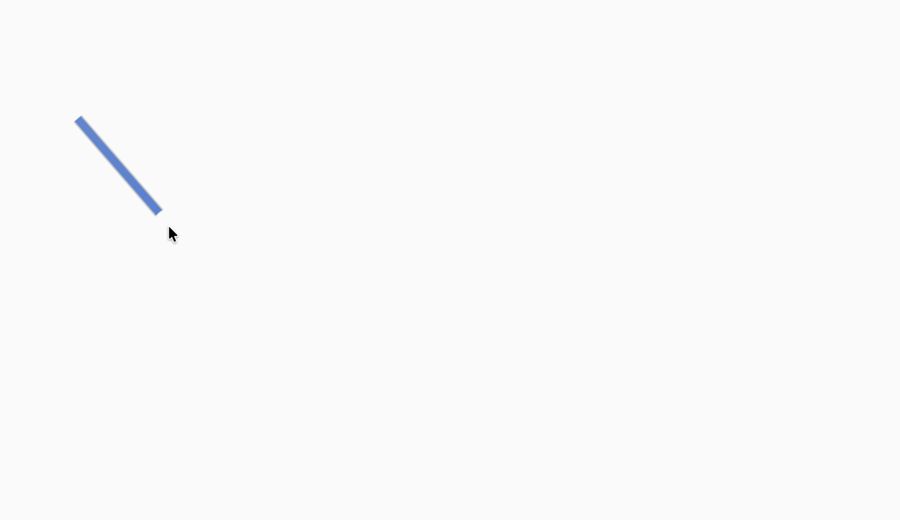
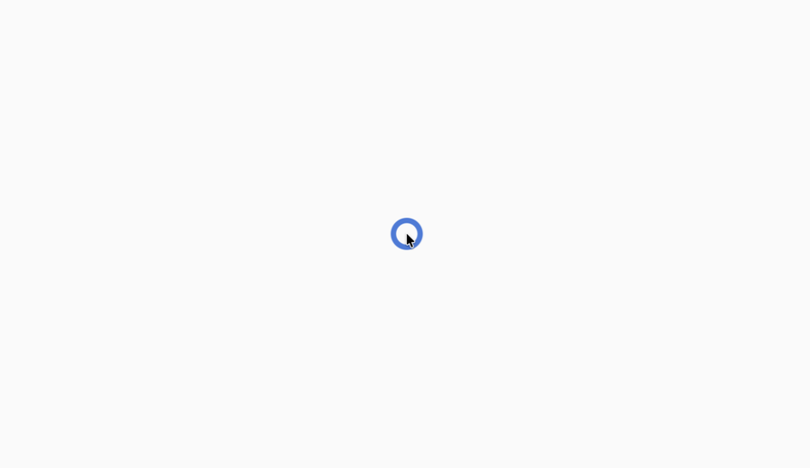
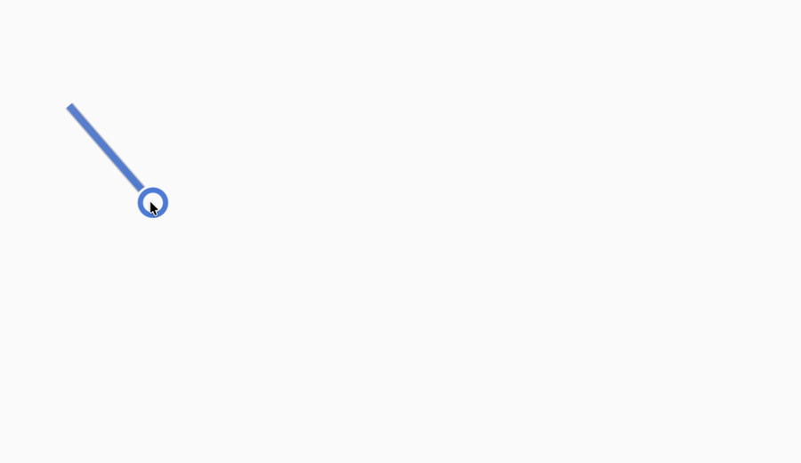
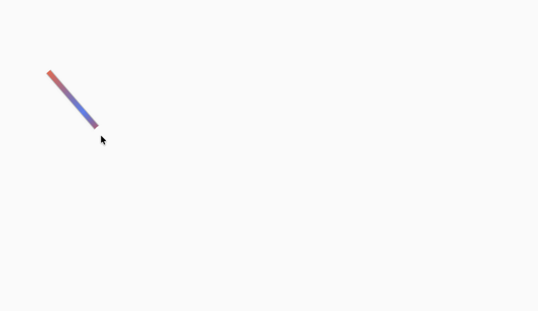

# Mouse Locator

[](https://github.com/bric3/macos-mouse-locator/actions/workflows/ci.yml)
[](https://github.com/bric3/macos-mouse-locator/actions/workflows/github-code-scanning/codeql)
[](https://github.com/bric3/macos-mouse-locator/tags)

> [!NOTE]
> **DISCLAIMER:** Almost entirely vibe-coded.

**Tired of shaking your mouse or trackpad just to find the pointer?**

Mouse Locator brings to macOS the mouse-finder effects that Linux desktops have
offered for years.

This native app makes the pointer easier to spot with two configurable cues:

- a fading Mouse Tail
- an Idle Pulse when movement resumes after inactivity

## Showcase

From left to right:

1. Mouse Tail.
2. Idle Pulse.
3. Mouse Tail and Idle Pulse together.
4. Rainbow Mouse Tail.

> [!NOTE]
> Idle Pulse appears when pointer movement resumes after the configured
> inactivity delay.

<p align="center">
  <picture><source media="(prefers-color-scheme: dark)" srcset=".github/docs/images/trail-dark.png"><source media="(prefers-color-scheme: light)" srcset=".github/docs/images/trail-light.png"></picture>
  <picture><source media="(prefers-color-scheme: dark)" srcset=".github/docs/images/idle-pulse-dark.png"><source media="(prefers-color-scheme: light)" srcset=".github/docs/images/idle-pulse-light.png"></picture>
  <picture><source media="(prefers-color-scheme: dark)" srcset=".github/docs/images/both-dark.png"><source media="(prefers-color-scheme: light)" srcset=".github/docs/images/both-light.png"></picture>
  <picture><source media="(prefers-color-scheme: dark)" srcset=".github/docs/images/rainbow-trail-dark.png"><source media="(prefers-color-scheme: light)" srcset=".github/docs/images/rainbow-trail-light.png"></picture>
</p>

## Features

Mouse Locator is available from the menu bar. Its two effects can be enabled
together and configured in the Mouse Locator pane in System Settings, which can
also be opened from the menu-bar menu. Tail and circle thickness are adjusted
independently and both default to 3 pt. After inactivity, the pulse follows the
pointer for three seconds and can use a chosen color or rainbow colors. The
tail also supports a chosen color or a smooth rainbow gradient. Its configurable
cursor gap defaults to 16 pt.

## Install

```sh
make install
```

Mouse Locator requires macOS 14 or later.

This installs Mouse Locator in `~/Applications`, installs its System Settings
pane in `~/Library/PreferencePanes`, registers it to launch at login, and starts
it. Running the same command later upgrades the application and keeps launch at
login registered. If macOS requires approval, System Settings opens to Login
Items.

> [!NOTE]
> **Pulse on modifier key** requires Input Monitoring access:
>
> 1. Open _System Settings | Privacy & Security | Input Monitoring_.
> 2. Click `+`, select `~/Applications/MouseLocator.app`, and turn it on.
> 3. Return to _System Settings | Mouse Locator_ and confirm that access is
>    shown as granted. If it is not, quit and reopen Mouse Locator.
>
> Mouse Tail and the movement-triggered Idle Pulse require no additional
> privacy permission. Accessibility access is not required.

Local ad-hoc builds reset Mouse Locator's Input Monitoring grant during installation
because their signing identity changes after each rebuild. Grant access again when
prompted. To preserve it across upgrades, install with a stable signing identity:

```sh
make install CODESIGN_IDENTITY="Apple Development: Your Name (TEAMID)"
```

## Uninstall

```sh
make uninstall
```

This stops the application, unregisters it from Login Items, and removes the
application and System Settings pane. Saved settings are kept.

## Configuration

Preferences are stored in `$XDG_CONFIG_HOME/mouse-locator/settings.toml`, or
`~/.config/mouse-locator/settings.toml` when `XDG_CONFIG_HOME` is unset. Existing
JSON preferences are imported automatically on first launch and retained as a backup.

Settings intended for manual editing only:

- `modifierTapDuration`: maximum duration in seconds for a modifier-only tap;
  defaults to `0.35`.
- `tailDotsEnabled`: defaults to `false`; set it to `true` to restore rounded
  sample-point caps.
- `tailSmoothing`: defaults to `"bezier"`; set it to `"none"` for straight
  segments.

Restart Mouse Locator after editing the TOML file manually.

## Contributing

See [CONTRIBUTING.md](CONTRIBUTING.md) for build, test, and showcase-image
instructions.

## License

[Mozilla Public License 2.0](LICENSE)
