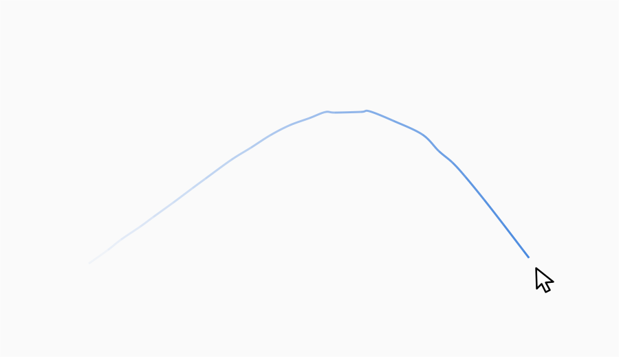
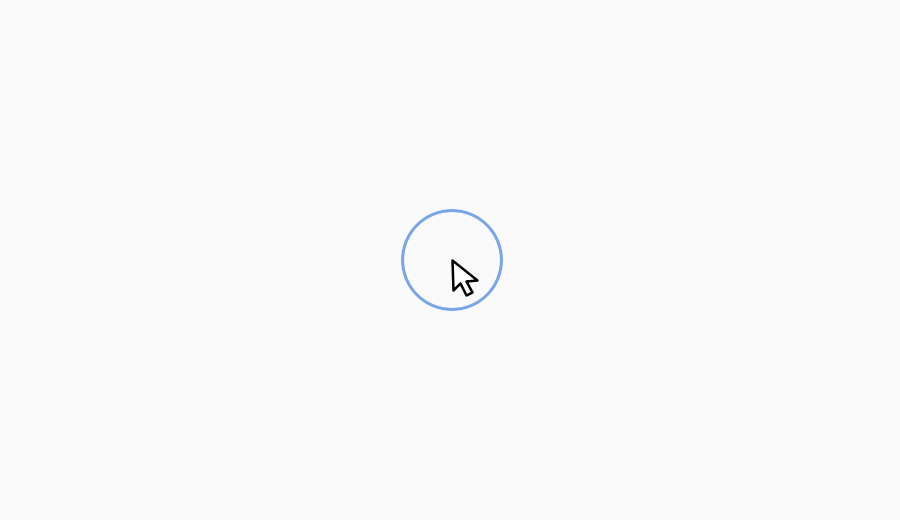
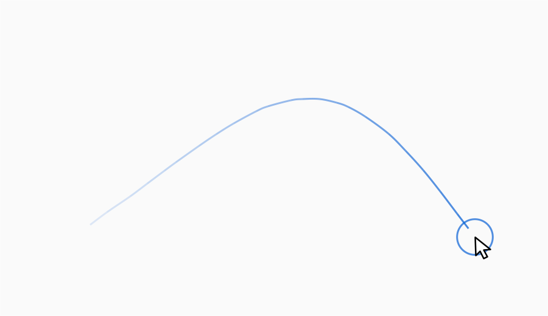
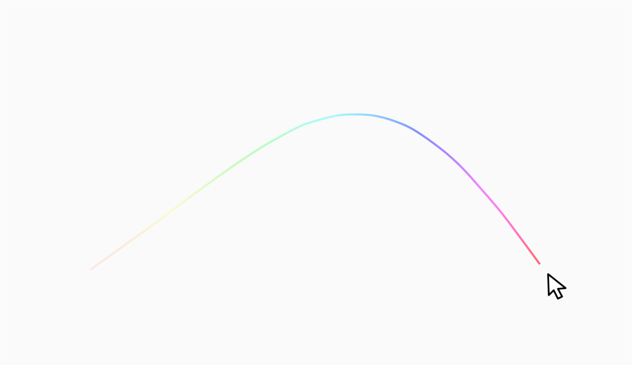

# Mouse Locator

A native macOS menu bar app that makes the pointer easier to find with a
configurable fading mouse trail and an idle pulse when movement resumes after
inactivity.

## Showcase

### Mouse trail

<picture>
  <source media="(prefers-color-scheme: dark)" srcset="github/docs/images/trail-dark.png">
  <source media="(prefers-color-scheme: light)" srcset="github/docs/images/trail-light.png">
  
</picture>

### Idle pulse

<picture>
  <source media="(prefers-color-scheme: dark)" srcset="github/docs/images/idle-pulse-dark.png">
  <source media="(prefers-color-scheme: light)" srcset="github/docs/images/idle-pulse-light.png">
  
</picture>

### Mouse trail and idle pulse

<picture>
  <source media="(prefers-color-scheme: dark)" srcset="github/docs/images/both-dark.png">
  <source media="(prefers-color-scheme: light)" srcset="github/docs/images/both-light.png">
  
</picture>

### Rainbow trail

<picture>
  <source media="(prefers-color-scheme: dark)" srcset="github/docs/images/rainbow-trail-dark.png">
  <source media="(prefers-color-scheme: light)" srcset="github/docs/images/rainbow-trail-light.png">
  
</picture>

## Requirements

- macOS 14 or later
- Swift 6 toolchain

## Build

```sh
make test
make app
open .build/MouseLocator.app
```

Regenerate all showcase images over an isolated blank panel with:

```sh
make screenshots
```

The command temporarily stops and restores an installed Mouse Locator process.
It uses isolated temporary settings and does not modify the user configuration.

Mouse Locator is available from the menu bar. Its two effects can be enabled
together and configured from either the menu-bar Settings window or the Mouse
Locator pane in System Settings. Trail and circle thickness are adjusted
independently and both default to 3 pt. After inactivity, the pulse follows the
pointer for three seconds and can use either a chosen color or rainbow colors.
The trail also supports a chosen color or a spatial rainbow.
Its configurable cursor gap defaults to 16 pt.

Preferences are stored in `$XDG_CONFIG_HOME/mouse-locator/settings.json`, or
`~/.config/mouse-locator/settings.json` when `XDG_CONFIG_HOME` is unset. Existing
preferences are migrated automatically the first time this version starts.

Settings intended for manual editing only:

- `tailDotsEnabled`: defaults to `false`; set it to `true` to restore rounded
  sample-point caps.
- `tailSmoothing`: defaults to `"bezier"`; set it to `"none"` for straight
  segments.

Restart Mouse Locator after editing the JSON file manually.

## Install

```sh
make install
```

This installs Mouse Locator in `~/Applications`, installs its System Settings
pane in `~/Library/PreferencePanes`, registers it to launch at login, and starts
it. Running the same command again upgrades and re-registers the application.
If macOS requires approval, System Settings opens to Login Items.

## Uninstall

```sh
make uninstall
```

This stops the application, unregisters it from Login Items, and removes the
application and System Settings pane. Saved settings are kept.

## License

[Mozilla Public License 2.0](LICENSE)
